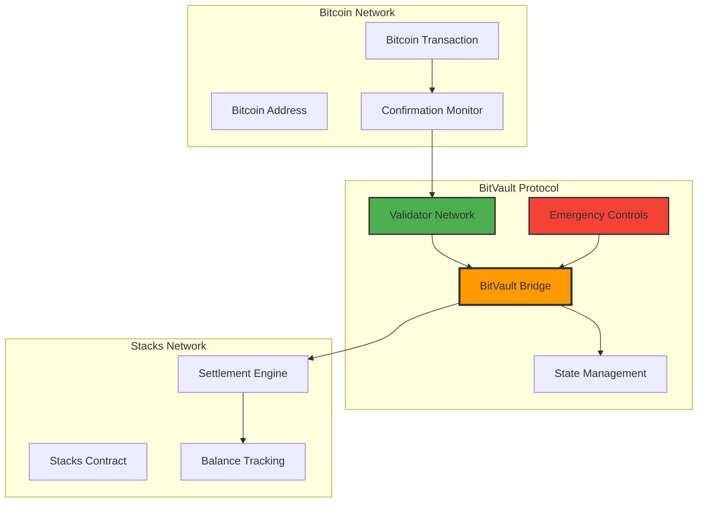
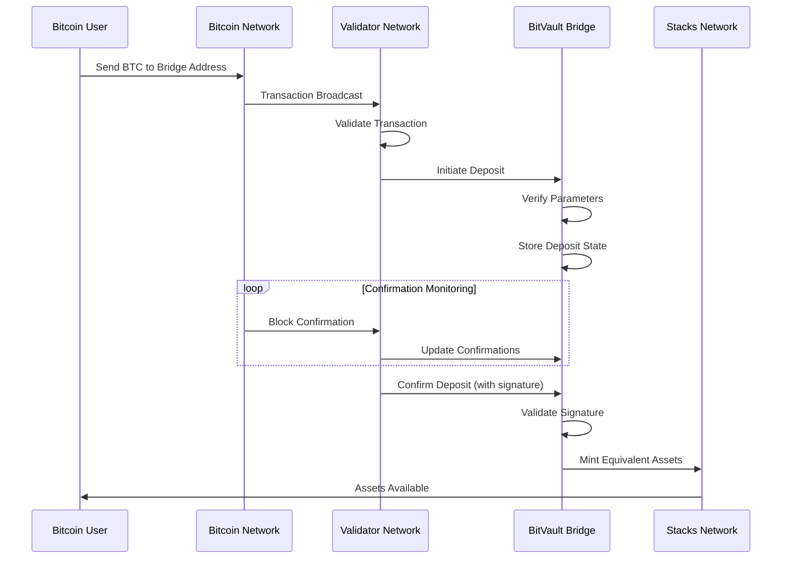
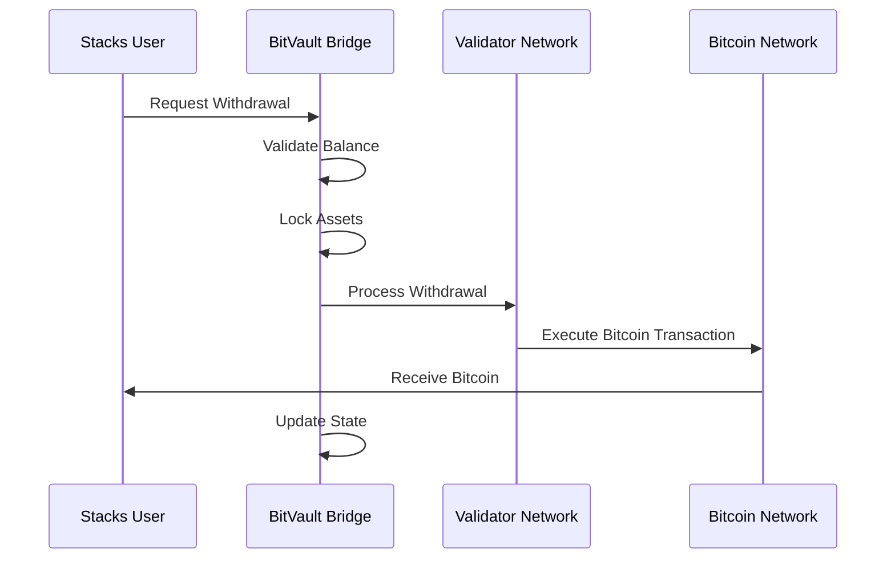

# BitVault Bridge Protocol

> **Revolutionary Cross-Chain Infrastructure for Bitcoin-Stacks Interoperability**

BitVault Bridge Protocol is a next-generation trustless bridge that enables seamless value transfer between Bitcoin and Stacks networks. Built with institutional-grade security and advanced cryptographic validation, BitVault leverages multi-party consensus to ensure atomic cross-chain settlements while maintaining full decentralization.

[](https://opensource.org/licenses/MIT)
[](https://stacks.co)
[](https://github.com/bitvault/security)

---

## 🎯 **Core Innovation**

BitVault introduces a novel approach to cross-chain value transfer by combining Bitcoin's proof-of-work security with Stacks' programmability. The protocol maintains full decentralization while providing institutional-grade security through sophisticated validator networks and emergency safeguards.

### **Key Features**

- **🔐 Cryptographic Proof Verification**: Advanced signature validation ensures authentic Bitcoin transaction proofs
- **🌐 Multi-Validator Consensus**: Distributed validation prevents single points of failure
- **⚡ Atomic Settlement**: Guarantees complete transaction execution or complete rollback
- **🛡️ Circuit Breaker Protection**: Automated emergency mechanisms for anomalous conditions
- **📊 Rate Limiting & Thresholds**: Configurable limits for sustainable operations
- **🔄 Real-Time Monitoring**: Continuous validation and state verification

---

## 🏗️ **System Overview**



BitVault operates as a trustless intermediary that validates Bitcoin transactions and mints equivalent assets on Stacks. The system employs a multi-layered security architecture with distributed validators, cryptographic proofs, and emergency controls.

---

## 🔧 **Contract Architecture**

### **Core Components**

#### **1. Validator Network**

- **Multi-Signature Consensus**: Requires multiple validator confirmations
- **Distributed Trust**: No single point of failure
- **Dynamic Management**: Add/remove validators through governance

#### **2. State Management**

- **Deposit Tracking**: Comprehensive transaction state monitoring
- **Balance Management**: Secure custody of cross-chain assets
- **Confirmation Thresholds**: Configurable Bitcoin confirmation requirements

#### **3. Security Framework**

- **Input Validation**: Rigorous parameter checking
- **Circuit Breakers**: Emergency pause mechanisms
- **Rate Limiting**: Protection against flash attacks

### **Data Structures**

```clarity
;; Deposit Structure
{
    amount: uint,           // Amount in satoshis
    recipient: principal,   // Stacks recipient address
    processed: bool,        // Processing status
    confirmations: uint,    // Bitcoin confirmations
    timestamp: uint,        // Block height timestamp
    btc-sender: (buff 33)   // Bitcoin sender address
}

;; Validator Signature
{
    signature: (buff 65),   // Cryptographic signature
    timestamp: uint         // Validation timestamp
}
```

---

## 📈 **Data Flow**

### **Deposit Process**



### **Withdrawal Process**



---

## 🔒 **Security Model**

### **Multi-Layered Defense**

1. **Cryptographic Validation**
   - Ed25519 signature verification
   - Bitcoin transaction proof validation
   - Multi-signature threshold schemes

2. **Consensus Mechanisms**
   - Distributed validator network
   - Byzantine fault tolerance
   - Slashing conditions for malicious behavior

3. **Emergency Controls**
   - Circuit breaker activation
   - Emergency withdrawal procedures
   - Governance override mechanisms

### **Risk Mitigation**

- **Amount Limits**: Configurable min/max deposit amounts
- **Rate Limiting**: Transaction frequency controls
- **Confirmation Requirements**: Bitcoin block confirmation thresholds
- **Validator Diversity**: Geographic and institutional distribution

---

## 🚀 **Use Cases**

### **DeFi Integration**

Enable Bitcoin holders to participate in Stacks-based decentralized finance applications while maintaining Bitcoin exposure.

### **Institutional Custody**

Provide secure, programmable Bitcoin custody solutions with smart contract automation for institutional clients.

### **Cross-Chain Asset Management**

Facilitate portfolio diversification across Bitcoin and Stacks ecosystems with seamless asset transfer.

### **Bitcoin-Backed Protocols**

Support algorithmic stablecoins and lending protocols collateralized by Bitcoin.

---

## 📊 **Technical Specifications**

| Parameter | Value | Description |
|-----------|-------|-------------|
| **Minimum Deposit** | 0.001 BTC | Minimum transaction amount |
| **Maximum Deposit** | 10 BTC | Maximum single transaction |
| **Confirmation Threshold** | 6 blocks | Bitcoin confirmation requirement |
| **Validator Threshold** | 2/3 majority | Consensus requirement |
| **Emergency Timeout** | 24 hours | Emergency response window |

---

## 🔧 **Configuration**

### **Protocol Parameters**

```clarity
;; Core Configuration
(define-constant MIN-DEPOSIT-AMOUNT u100000)      ;; 0.001 BTC
(define-constant MAX-DEPOSIT-AMOUNT u1000000000)  ;; 10 BTC
(define-constant REQUIRED-CONFIRMATIONS u6)       ;; Bitcoin confirmations
```

### **Error Codes**

| Code | Category | Description |
|------|----------|-------------|
| 1000-1099 | Authorization | Security and permission errors |
| 1100-1199 | Validation | Input validation failures |
| 1200-1299 | State | Protocol state errors |

---

## 🛠️ **Development**

### **Prerequisites**

- Stacks CLI
- Clarinet
- Node.js 16+
- Bitcoin Core (for testing)

### **Local Development**

```bash
# Clone repository
git clone https://github.com/grace-obong/bitvault.git

# Install dependencies
npm install

# Run tests
clarinet test

# Deploy to testnet
clarinet deploy --testnet
```

---

## 🤝 **Contributing**

We welcome contributions to BitVault Bridge Protocol. Please read our [Contributing Guidelines](CONTRIBUTING.md) and [Code of Conduct](CODE_OF_CONDUCT.md) before submitting pull requests.

---

## 📄 **License**

BitVault Bridge Protocol is licensed under the MIT License. See [LICENSE](LICENSE) for details.
